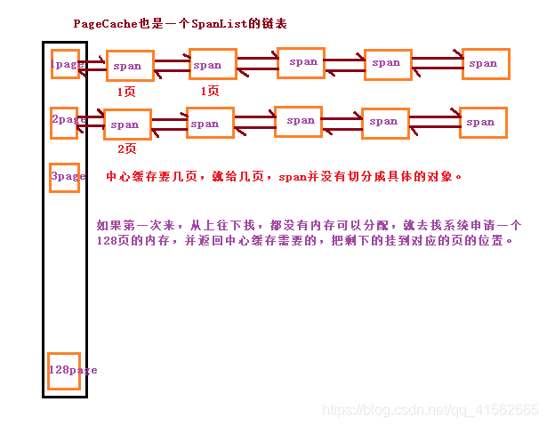
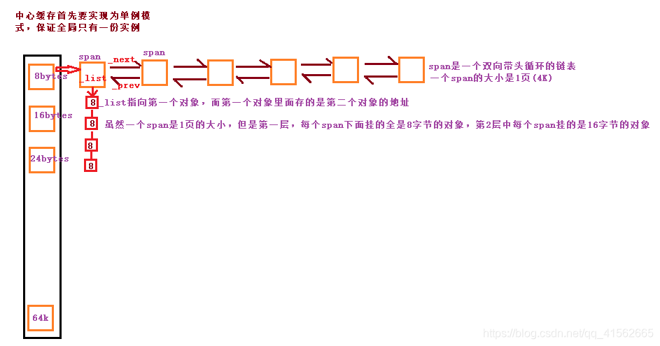
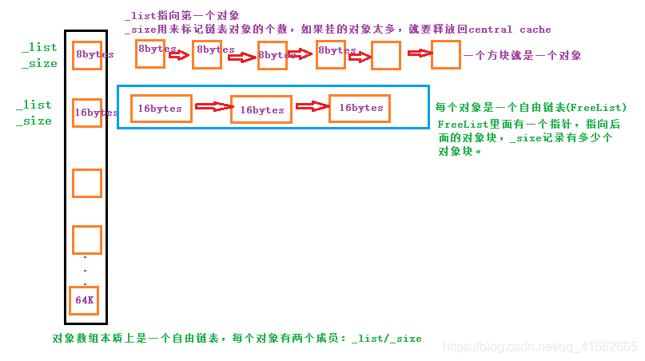

## ConcurrentMemoryPool

内存池项目 原项目地址：https://github.com/Winter-Win/ConcurrentMemoryPool

使用环境：VS2022 双击sln文件

性能说明：申请小内存时性能差于malloc/free，申请较大内存(例如超过16KB)时，性能会好于malloc/free，其中线程数量增加时性能会下降(因为使用了锁)。主要瓶颈在于释放内存的时间(ConcurrentFree)。

问题：可能存在内存泄漏但是自己没有发现；仍然离不开new/delete(底层仍是malloc/free);目前只能在Windows平台运行；

---

### 代码注释

#### Common.h

> 这个文件包含了一些C++的库文件，定义了一些全局变量(用于控制内存大小和数组长度)，定义了一个函数用于遍历自定义链表，还定义了三个类，这些都在后续会使用，是一个公共头文件

1. 遍历链表的函数：

   ```cpp
   inline static void*& NEXT_OBJ(void* obj)//抢取对象头四个或者头八个字节，void*的别名，本质是内存，只能我们自己取
   {
   	return *((void**)obj);   // 先强转为void**,然后解引用就是一个void*
   }
   ```

   假设我们又连续的一段内存，我们将这个内存分为每个大小为n字节的若干小段，我们让每个小段的前一个指针大小长度的内存存放下一个小段的首地址，依次类推，这样我们就获得了一个链表，每个小段就是一个节点，我们可以通过上面的`NEXT_OBJ`函数传入本节点地址，返回下一个节点的地址。

2. 专门用来计算位置对齐操作的类`SizeClass`

   ```cpp
   // 控制在12%左右的内碎片浪费
   // [1,128]				8byte对齐 freelist[0,16)
   // [129,1024]			16byte对齐 freelist[16,72)
   // [1025,8*1024]		128byte对齐 freelist[72,128)
   // [8*1024+1,64*1024]	1024byte对齐 freelist[128,184)
   // [8 16 24 32 .... 128 144160 ... 1024 1152....]
   ```

   成员函数

   ```cpp
   inline static size_t _Index(size_t size, size_t align){
   	size_t alignnum = 1 << align;  //库里实现的方法
   	return ((size + alignnum - 1) >> align) - 1;
   }
   /*
   这个函数的功能是传入一个内存大小(单位字节)和其对齐方式，计算出其应在的索引位置。第一个参数size是内存大小，第二个参数的对齐方式(2的幂,如传3代表以2的3次方也就是8字节对齐)。这里计算的原理是先补齐一个对齐的大小获得一个最靠近对其大小整数倍的值，然后直接进行除法操作获得索引，当然索引从0开始，因此最后要减1。注意这里的计算是认为整个内存只有一种对齐方式，因此我们需要对其进行进一步封装才可适应我们上述的多种对其方式的内存规划
   */
   ```

   ```cpp
   inline static size_t _Roundup(size_t size, size_t align){
   	size_t alignnum = 1 << align;
   	return (size + alignnum - 1)&~(alignnum - 1);
   }
   /*
   这个函数的参数与上一个函数参数含义相同，但是这个函数的目的是计算size大小在对应对其规则下应该被补充道多少个字节，也就是获取一个大于size但最靠近size的对齐大小整数倍的值，例如以8字节对其，如果size=3,则会输出8。这个函数的思路也是先将size加上一个(对齐大小-1)的值,然后进行与操作，忽略其余数
   */
   ```

   ```cpp
   inline static size_t Index(size_t size);
   /*
   对_Index函数的进一步封装，以适应我们多对齐方式的索引计算
   */
   ```

   ```cpp
   static inline size_t Roundup(size_t bytes);
   /*
   对_Roundup函数的进一步封装，用来计算不同对齐大小时向上取整的数目
   */
   ```

   ```cpp
   static size_t NumMoveSize(size_t size);
   /*
   动态计算从中心缓存分配多少个size大小的内存到ThreadCache中,size单位是字节，返回的范围是[2,512]
   */
   ```

   ```cpp
   static size_t NumMovePage(size_t size);
   /*
   根据size计算中心缓存要从页缓存获取多大的span对象,内部调用了NumMoveSize函数,处理过程是首先通过NumMoveSize函数计算分配多少个size大小的内存对象，然后统计这么多内存对象一共占用多少页大小(每页4K字节)，如果不满一页，则补齐一页，返回值是分配的页数
   */
   ```

   ```cpp
   /* 关于动态计算
   size		NumMoveSize		NumMovePage
   4       	512     		1
   8       	512     		1
   16      	512     		2
   32      	512     		4
   64      	512     		8
   128     	512     		16
   256     	256     		16
   512     	128     		16
   1024    	64      		16
   1024*8    	8       		16
   1024*16   	4       		16
   1024*64   	2       		32
   1024*128  	2       		64
   */
   ```

   

3. 自由链表类`FreeList`

   FreeList将会用在ThreadCache中，用来进行内存管理。FreeList是一个双向链表，其相关接口由我们自己实现

   ```cpp
   //成员变量
   void* _list=nullptr;//链表头部，void类型的指针用来指向内存，可以使用NEXT_OBJ函数将这内存连接成链表
   size_t size=0;//记录链表中有多少个节点
   size_t _maxsize=1;//节点的最大个数？
   ```

   成员函数：

   ```cpp
   void Push(void* obj);//链表头部加入一个内存对象，obj是内存地址
   void PushRange(void* start, void* end, size_t n);//加入若干个内存对象，start和end是第一个和最后一个内存对象的地址，n是对象个数
   void* Pop();//将链表头部对象弹出
   void* PopRange();//弹出链表全部元素，这个函数命名有些不清楚
   bool Empty();//判断链表是否为空
   size_t Size();//返回链表中对象的个数
   size_t MaxSize();//返回链表最大个数
   void SetMaxSize(size_t maxsize);//设置链表最大个数
   ```

4. 内存单元类`Span`

   ```cpp
   #ifdef _WIN32
   	typedef size_t PageID;
   #else
   	typedef long long PageID;
   #endif //_WIN32
   ```

   原作者是这样解释Span的：Span是一个跨度，既可以分配内存出去，也是负责将内存回收回来到PageCache合并；是一链式结构，定义为结构体就行，避免需要很多的友元。通过对代码的阅读，我的理解是Span代表内存单元，每个单元可以有不同大小的内存且这些内存是连续的，在后续的PageCache和CentralCache中，均使用了Span构成的链表。

   ```cpp
   struct Span
   {
   	PageID _pageid = 0;//页号，代表这个内存的首地址
   	size_t _npage = 0;//页数，可以用来计算这块内存的大小
   	//上述变量用在PageCache中
       
   	Span* _prev = nullptr; 
   	Span* _next = nullptr;
   	//链表指针，用于构造SpanList
       
   	void* _list = nullptr;//链接对象的自由链表，后面有对象就不为空，没有对象就是空
   	size_t _objsize = 0;//对象的大小,这里是将页面的内存划分为若干个大小为_objsize的更小的内存块-->存疑
   
   	size_t _usecount = 0;//对象使用计数,这里是对更小的内存块的计数
   };
   ```

5. 内存单元链表`SpanList`

   顾名思义，SpanList使用来管理由Span构成的链表的，这是一个环形双向链表，类似于之前的FreeList，各个接口自行实现

   成员变量：

   ```cpp
   public:
   Span* _head;//链表头指针，用来获取链表头部元素和尾部元素
   std::mutex _mutex;//考虑到多线程的程序可能会存在同时申请和释放内存的情况，因此对于临界资源SpanList的操作需要上锁
   ```
   
   成员函数：
   
   ```cpp
   SpanList();//默认构造函数，用于初始化双向链表(成环)
   ~SpanList();//释放链表的每个节点，因为每个节点都是通过new关键字申请的
   //防止拷贝构造和赋值构造，将其封死，没有拷贝的必要，不然就自己会实现浅拷贝，这里使用了C++11引入的新特性
   SpanList(const SpanList&) = delete;
   SpanList& operator=(const SpanList&) = delete;
   Span* Begin();//返回头指针指向的节点
   Span* End();//返回头指针
   bool Empty();//判断链表是否为空
   void Insert(Span* cur, Span* newspan);//在cur节点前面插入newspan
   void Erase(Span* cur);//删除节点cur，此处只是单纯的把节点拿出来，并没有释放掉，后面还有用处
   void PushBack(Span* newspan);//尾插元素
   void PushFront(Span* newspan);//头插元素
   Span* PopBack();//弹出尾部元素
   Span* PopFront();//弹出头部元素
   void Lock();//上锁
   void Unlock();//解锁
   ```
   
   
   
   
   
   ---
   
#### PageCache.h/cpp

   > 这里使用了Windows操作系统提供的API，[VirtualAlloc](https://learn.microsoft.com/zh-cn/windows/win32/api/memoryapi/nf-memoryapi-virtualalloc)和[VirtualFree](https://learn.microsoft.com/zh-cn/windows/win32/api/memoryapi/nf-memoryapi-virtualfree)，用来向操作系统申请内存。



   PageCache是这个内存池的第三层，其管理的内存以页为单位(每页大小为4K)。其与CentralCache直接相连，当CentralCache中没有内存对象(Span)时，分配一定数量的Page并切割成规定大小的若干个内存对象；当CentralCache中存在空闲内存时，则进行回收操作并尝试将回收的内存进行合并组成更大的空闲连续内存。

   从原作者给出的设计思路可知，每个进程中只会存在一个PageCache，因此我们可以将**PageCache类**设计成单例模式，这里记录一下在这个项目中设计成单例模式的方法：

   PageCache中的SpanList会将分配的Span弹出，但是由于存在`_idspanmap`我们仍然能够将弹出的Span找回并存放在SpanList的合适位置。

   ```cpp
   //1. 删除了复制构造函数，防止拷贝
   PageCache(const PageCache&) = delete;
   //PageCache& operator=(const PageCache&) = delete;//是否需要？
   
   //2. 在类中定义了自身类型的静态私有变量
   private:static PageCache _inst;//可以定义自身类型，而且不是指针，第一次见
   
   //3. 在类中定义返回_inst的公有静态函数
   public:static PageCache* GetInstence() {return &_inst;}
   
   //4. 在文件PageCache.cpp中声明静态变量PageCache PageCache::_inst，因为静态变量需要类内申明，类外初始化;
   ```

   成员变量：

   ```cpp
   private:
   SpanList _spanlist[NPAGES];/*NPAGES=129 _spanlist[i]表示这个SpanList中存放的都是大小为i个页面的内存对象，在设计时将最大内存单元控制在128页大小，超过128页直接向系统申请内存。*/
   
   std::unordered_map<PageID,Span*> _idspanmap;/*用于映射页号和所在内存单元，这里主要是为了CentralCache服务的，同时也是零碎内存合并需要的条件*/
   
   std::mutex _mutex;/*多线程下PageCache作为临界资源操作需要上锁*/
   ```

   成员函数：

   ```cpp
   private:
   PageCache();//默认构造函数，没有实现任何内容
   
   PageCache(const PageCache&) = delete;//删去复制构造函数，防止拷贝
   
   public:
   static PageCache* GetInstence();//返回单例对象的指针
   
   Span* AllocBigPageObj(size_t size);
   /*(CentralCache)尝试申请一个内存大小为size(byte)的内存对象(注意这里size需要大于64K，否则直接assert失败)，首先当然需要让size进行对齐计算，按4K对齐计算其需要多少页。如果申请的内存大小超过128页，则调用VirtualAlloc函数申请内存，同时在这个超大的内存头部进行一次PageID到Span*的映射，也就是_idspanmap中进行记录；如果申请的内存大小不超过128页，则调用我们自己实现的函数NewSpan分配一个内存对象*/
   
   void FreeBigPageObj(void* ptr, Span* span);
   /*释放一个内存对象，第一个参数是内存对象的指向内存的首地址，span就是我们释放的目标内存对象。这里的操作依然是一分为二的，如果span对象的内存大于128页，则使用系统提供的函数VirtualFree进行内存的释放，并且在_idspanmap中删除映射；如果span对象的内存大小不超过128页，则使用我们自己的函数RelaseSpanToPageCache进行内存释放。
   QUESTION? 这里是否可以少传递一个参数，因为ptr可以通过span的成员计算出来--> void* ptr = (void*)(span->_pageid << PAGE_SHIFT);*/
   
   Span* _NewSpan(size_t n);
   /*申请一个内存大小为n页的对存对象，这里的思路是首先寻找_spanlist[n]中是否有空闲的内存对象，因为这是大小最合适的，如果_spanlist[n]没有空闲，则从_spanlist[n+1]开始搜索一直到_spanlist[128],如果找到任何一个空闲Span，则将其拆分为二，其一为我们需要打下，剩下在插入相应的_spanlist[x]中。如果一直搜索到_spanlist[128]还是没有找到空闲的内存对象，则从系统分配一个128页大小的内存放入一个内存对象中，并将这个内存对象插入到_spanlist[128]中，然后重新调用一次_NewSpan函数。这里拆分一个span的做法就是操作Span::_pageid和Span::_npage两个值然后更新_idspanmap。
   QUESTION? 在PageCache类中，对于一个Span对象，Span::_objsize应该是试图设置为Span::_npage>>12,但是在这个函数中似乎又忘记更新这个值了，而且这个值在这一步设不设置真的意义不大-->存疑，另外我觉得还有一个可以优化的地方，就是从系统分配内存后重新执行一遍该函数，会造成一些不必要的循环，是否可以直接分配而不需要重新调用一次。
   */
   
   Span* NewSpan(size_t n);
   /*对_NewSpan函数的封装，其在执行过程中全程加锁*/
   
   void ReleaseSpanToPageCache(Span* span);
   /*将span从CentralCache中归还给PageCache。为了防止多线程执行时造成不可预估的影响，此函数全程上锁。对于总内存大于128页的span对象，其内存的回收是使用系统提供的VirtualFree函数；对于总内存不超过128页的span对象，在归还时需要尝试进行合并操作，因为连续的大内存空间利用率更高，我们合并的方法是：1.向上合并：计算span内存第一个页号紧接着的前一个页号(减一操作)，然后利用_idspanmap找到对应span对象然后判断其是否使用过，如果没有使用过且合并后小于128页，则进行合并，合并后继续向上重复直至不能合并。向下合并：找到span内存的最后页号的下一个页号，同样利用_idspanmap找到其所在内存对象，判断是否使用过，如果没有使用过并且合并后小于128页，则合并，重复向下合并直至无法继续合并。最后将合并后的span插入_spanlist[span->_npage]中。合并页面操作盒页面拆分操作差不多，都是操作Span::_pageid,Span::_npage，并且更新_idspanmap。
   */
   
   Span* MapObjectT
       oSpan(void* obj);
   /*传入一个内存地址，返回其所在的span对象，具体做法是将obj右移12位获取所在页面id，然后在_idspanmap中询查即可*/
   ```

   

---

   

   #### CentralCache.h/cpp

   > 与PageCache.h一样，这个头文件中只定义了一个类`CentralCache`



   在这个内存池的结构中，CentralCache处于中间层，与PageCache和ThreadCache都直接连接。PageCache为CentralCache提供内存申请和释放的服务，而CentralCache则为ThreadCache提供了内存申请和释放服务。在一个进程中，只需要有一个CentralCache，所以CentralCache类依旧被设置为单例模式，方式与PageCache相同。同时考虑到对多线程的支持，而CentralCache又是临界资源，因此对CentralCache的操作需要上锁。

   CentralCache中的SpanList不会弹出Span，而是将其放到循环链表尾部，让空闲链表在循环链表头部。

   成员变量：

   ```cpp
   private:
   SpanList _spanlist[NLISTS];
   /*NLISTS=184,_spanlist[i]代表这个SpanList对象中的每个节点(节点类型是Span)中内存被划分为下面规则大小的更小块(或者称为对齐方式？)。注意SpanList是一个环形双向链表且有头节点，在CentralCache中_spanlist[i]中的一个Span中的内存被分配出去时，这个Span不会被弹出链表而是会被移动至链表尾部。*/
   //数组含义参考：
   // 控制在12%左右的内碎片浪费
   // [1,128]				8byte对齐  _spanlist[0,16)
   // [129,1024]			16byte对齐  _spanlist[16,72)
   // [1025,8*1024]		128byte对齐  _spanlist[72,128)
   // [8*1024+1,64*1024]	1024byte对齐  _spanlist[128,184)
   // [8 16 24 32 .... 128 144 160 ... 1024 1152....]
   
   static CentralCache _inst;//单例模式设计
   ```

   成员函数：

   ```cpp
   private:
   CentralCache();//默认构造函数，没有实现任何内容
   
   CentralCache(CentralCache&) = delete;//删去复制构造函数，防止无意中的复制
   
   public:
   static CentralCache* Getinstence();//返回单例对象本身的地址
   
   Span* GetOneSpan(SpanList& spanlist, size_t byte_size);
   /*
   传入一个spanlist变量的引用，这个spanlist应该是_spanlist[SizeClass::Index(byte_size)]，byte_size是每个更小内存块的大小，返回一个spanlist中的空闲Span。这个函数执行的主要思路是：首先找到spanlist链表的头结点，一个一个向下找，当找到一个没有使用的Span时，则返回这个Span，如果找不到空闲的Span，则通过调用PageCache::NewSpan()函数来分配一个Span对象，这个Span的总大小是通过byte_size计算出来的,最大不超过64K字节。从PageCache中分配的Span并没有被划分成更小的块，因此需要进行划分，这里就会使用到common.h中的NEXT_OBJ函数，同时这里需要将新分配的span->_objsize设置为byte_size，最后需要将这个新分配的Span头插到spanlist中。由于这个函数传递参数的条件比较苛刻，因此应该会被进一步封装
   */
   
   size_t FetchRangeObj(void*& start, void*& end, size_t n, size_t byte_size);
   /*
   尝试获取n个byte_size字节大小的连续小单元内存空间，start保存第一个小首地址单元地址，end保存最后一个小单元的内存首地址，返回值是实际获取小单元的数量。申请内存操作需要考虑多线程的影响，因此需要全程上锁。
   */
   
   void ReleaseListToSpans(void* start, size_t size);
   /*
   释放从地址start开始组成的小内存单元链表，每个小内存单元大小为size字节。这里遍历链表的方式是使用NEXT_OBJ函数，当我们获取一个小内存的首地址start时，通过调用PageCache::GetInstence()->MapObjectToSpan(start)来获得这个小内存单元属于哪个span，然后将小内存单元插入到这个span的_list中，同时判断这个span是否现在处于未使用状态，如果是则调用PageCache::GetInstence()->ReleaseSpanToPageCache(span)来回收这个未使用的span，然后通过NEXT_OBJ函数找到下一个小内存单元的首地址，重复上述操作知道没有下一个小内存单元。整个循环过程需要上锁
   */
   ```

   

---

   #### ThreadCache.h/cpp

   ThreadCache类用于线程申请和释放内存，其提供了相关接口，同时TreadCache从CentralCache中获取内存，并在内存利用率较低时将多余内存还给CentralCache。TreadCache申请和释放内存都是以个为单位的，例如申请一个4个字节大小的内存空间。



   成员变量：

   ```cpp
   private:
   Freelist _freelist[NLISTS];
   // 控制在12%左右的内碎片浪费
   // [1,128]				8byte对齐 freelist[0,16)
   // [129,1024]			16byte对齐 freelist[16,72)
   // [1025,8*1024]		128byte对齐 freelist[72,128)
   // [8*1024+1,64*1024]	1024byte对齐 freelist[128,184)
   // [8 16 24 32 .... 128 144160 ... 1024 1152....]
   /*在对Common.h的注释中有对FreeList的解释*/
   ```

   成员函数：

   ```cpp
   void* FetchFromCentralCache(size_t index, size_t size);
   /*
   从中心缓存获取若干个(动态计算)size大小(size已经经过对齐计算)的内存空间，由于我们的目的是只需要一个size大小的空间，但是我们可能申请了很多内存(这样是为了减少申请次数，避免锁竞争导致效率低下)，所以多余的内存空间会被放入ThreadCache中的_freelist[index]中。函数的具体执行流程是首先动态计算好从CentralCache中申请小内存单元的个数，然后调用CentralCache::Getinstence()->FetchRangeObj(start, end, numtomove, size)获取内存空间，之后我们将多申请的内存空间存储下来:freelist->PushRange(NEXT_OBJ(start), end, batchsize - 1)。最后返回start。这个函数传入参数的要求比较苛刻，主要是被另一个函数调用
   QUESTION?-->这里修改maxsize值的操作我没有看懂，不知道是怎么计算的，后面理解了再记录
   */
   
   void* Allocate(size_t size);
   /*
   申请大小为size字节的内存单元，这里size的值没有特殊限制，但是返回的内存单元大小将会是对齐后的大小。此函数的执行思路是：首先通过size计算出对应的index，从而找到目标freelist=_freelist[index](此自由链表存储的小内存单元是size对其后的大小)，如果freelist不为空我们可以直接弹出一个小内存单元，返回这个内存空间即可；如果freelist中已经没有内存空间则调用FetchFromCentralCache(index, SizeClass::Roundup(size))从CentralCache获取内存空间。
   */
   
   void ListTooLong(Freelist* list, size_t size);
   /*
   用于将ThreadCache中较长的freelist()归还给CentralCache，size是小内存单元的大小,参数list是我们释放的目标自由链表，其内部都是大小为size的小内存单元。这个函数内部通过调用CentralCache提供的接口CentralCache::Getinstence()->ReleaseListToSpans(start, size)来进行内存回收。
   */
   
   void Deallocate(void* ptr, size_t size);
   /*
   释放一个大小为size字节的内存单元，内存首地址是ptr。回收内存后查看对应的freelist，如果有太多内存未使用，则调佣ListTooLong函数回收至CentralCache。
   */
   
   _declspec (thread) static ThreadCache* tlslist = nullptr;
   /*
   线程局部存储变量，每一个线程都有一个该变量，用来申请和释放内存。
   */
   ```

   

---

#### ConcurrentAlloc.h

> 该头文件提供了两个对外接口，用来实现内存的申请和释放

```cpp
static inline void* ConcurrentAlloc(size_t size);
/*
申请size字节大小内存(返回的内存会进行对齐计算)。对于超过64K字节的内存，直接调用ageCache::GetInstence()->AllocBigPageObj(size)向系统申请内存；对于小于等于64K字节的内存空间，则调用自身的Allocate函数从内存池中申请内存。
*/

static inline void ConcurrentFree(void* ptr);
/*
传入需要释放的内存的首地址，释放该内存空间。这里释放内存空间的思路是首先通过ptr可以计算出内存所在页号(ptr>>12)，然后可以通过PageCache::GetInstence()->MapObjectToSpan(ptr)来获取ptr所在的Span进而获得该小内存单元的大小:size=Span->_objsize。同样一分为二：如果size大于64K，则直接交给系统进行内存释放，否则调用自身的Deallocate来将其释放到内存池中。
*/
```


---

#### UnitTest.cpp

> 单元测试

测试一些函数的功能是否能够正确实现

---

#### BenchMark.cpp

> 性能测试

于malloc/free进行性能比较

`SHOWTIME`宏用于开启/关闭控制台输出具体时间


#### radix_tree.hpp

> 该文件实现数据结构 -- 基数树，提供了 string-T 类型的映射关系

1. radix_tree_node

   核心数据结构

   ```cpp
   private:
   	std::map<K, radix_tree_node<K, T, Compare>*, Compare> m_children; // 每个节点维护一个map
       radix_tree_node<K, T, Compare> *m_parent; // 父节点
       value_type *m_value; // pair<cosnt K, T> 类型的指针
       int m_depth; // 深度
       bool m_is_leaf; // 是不是叶子节点
       K m_key; // K 键
       Compare& m_pred; // map的比较函数
   ```

   每一个节点记录了键值，键值对的指针，父节点，深度（对应前缀的长度）等。

2. radix_tree_it

   核心数据结构

   ```cpp
   private:
       radix_tree_node<K, T, Compare> *m_pointee; // 指向节点的指针，核心成员变量
   ```

   内部维护一个`radix_tree_node *`，这是一个前向迭代器，++iterator的做法是访问自己这个node的`m_children`，如果自己没有孩子，则访问自己的兄弟节点，如果还没有则访问叔叔节点......重写`oprerator*`和`operator->`，分别返回`radix_tree_node::value_type ->seconde`和维护的节点自身。

3. radix_tree

   核心数据结构

   ```cpp
   private:
       size_type m_size; // 节点的个数
       radix_tree_node<K, T, Compare>* m_root; // 根节点
   	Compare m_predicate; // 比较函数
   ```

   基数树存储值的规则是：如果到一个节点，组成的key是一个完整的key，也就是对应有value了，那么**它会创建一个孩子，这个孩子节点的键是空(nil)**，并将此孩子节点设置为叶子节点`m_is_leaf = true`，同时将此孩子的节点的`m_value`指向对应的键值对。

   ```cpp
   template <typename K, typename T, typename Compare>
   radix_tree_node<K, T, Compare>* radix_tree<K, T, Compare>::find_node(const K &key, radix_tree_node<K, T, Compare> *node, int depth);
   ```

   查询最接近的节点，输入一个key，在基数树中查找一个和key最匹配的节点，也就是说也可能正好找到key，也可能找不到，但是返回一个最接近的，看看一个例子：

   ```cpp
   /*
   (root)
   |
   |---------------
   |       |      |
   abcde   bcdef  c
   |   |   |      |------
   |   |   $3     |  |  |
   f   ge         d  e  $6
   |   |          |  |
   $1  $2         $4 $5
   
   find_node():
     bcdef  -> $3
     bcdefa -> bcdef
     c      -> $6
     cf     -> c
     abch   -> abcde
     abc    -> abcde
     abcde  -> abcde
     abcdef -> $1
     abcdeh -> abcde
     de     -> (root)
   */
   ```

   接下来我们的前缀匹配，插入，删除都需要依赖这个函数。

   ```cpp
   // 前缀匹配
   template <typename K, typename T, typename Compare>
   void radix_tree<K, T, Compare>::prefix_match(const K &key, std::vector<iterator> &vec);
   ```

   这里的key其实是我们的前缀。此函数内部调用find_node函数找到最接近的节点，然后判断这个最接近的节点的键值能否包含目标前缀，如果不能包含，则没有前缀匹配，否则继续调用`greedy_match`函数将符合的节点的迭代其放入参数vec中。

   ```cpp
   // 找到最匹配的节点，返回迭代器
   template <typename K, typename T, typename Compare>
   typename radix_tree<K, T, Compare>::iterator radix_tree<K, T, Compare>::longest_match(const K &key);
   ```

   ```cpp
   // 在 parent 节点之后添加键值对
   template <typename K, typename T, typename Compare>
   radix_tree_node<K, T, Compare>* radix_tree<K, T, Compare>::append(radix_tree_node<K, T, Compare> *parent, const value_type &val)；
   ```

   这里分两种情况，一种是parent节点对应的键就是目标键值，那么在parent后加入一个为键位nil的孩子节点，并将键值对保存在这个孩子节点即可。
   第二种是parent节点所代表的键只是目标键值的前缀，那么需要再次添加一个键值的非空的孩子节点，然后再次添加一个键值为空的孙子节点来保存键值对。

   ```cpp
   // 在 node 前方插入键值对
   template <typename K, typename T, typename Compare>
   radix_tree_node<K, T, Compare>* radix_tree<K, T, Compare>::prepend(radix_tree_node<K, T, Compare> *node, const value_type &val);
   ```

   我们首先需要找到插入键值对和node节点对应键的共同前缀，然后分别处理后面的部分。

   ```cpp
   // 删除一个键值对
   template <typename K, typename T, typename Compare>
   bool radix_tree<K, T, Compare>::erase(const K &key);
   ```

   删除键值对的操作就是删除对应的键位nil的叶子节点。但是我们要考虑将一些节点合并来减少基数树的高度。一是如果删去这个叶子节点后他的父节点的孩子节点少于一个，那么可以考虑将这个父节点和剩下子节点（如果有）进行合并。同时，如果处理到最后发现祖父节点也只有一个孩子了（对应的叔叔节点）那么可以将叔叔节点和祖父节点合并。


---

### 函数调用链

1. 一个线程单次申请64K字节以上的内存空间

   `ConcurrentAlloc(size)`->`PageCache::GetInstence()->AllocBigPageObj(size)`->`PageCache::NewSpan(npage)`/如果大于128K字节则直接向系统申请`VirtualAlloc`->`PageCache::_NewSpan(npage)`(没有多余内存时调用系统函数`VirtualAlloc`申请);

   ```cpp
   /*
   第一层，线程调用 ConcurrentAlloc函数申请size字节大写，这里size大于64K；
   第二层，ConcurrentAlloc函数调用PageCache::AllocBigPageObj函数,获得一个Span对象，直接将这个Span对象的内存首地址返回;
   第三层，AllochBigPageObj函数首先将size进行对齐计算转换为需要开辟的页数(每页4K)，如果大于128页则直接调用VirtualAlloc系统函数，否则调用PageCache::NewSpan函数来获取一个Span对象。这里我们更新了这个Span的_usecount=1。
   第四层，NewSpan函数上锁，调用PageCache::_NewSpan函数来获取一个Span对象。
   第五层，_NewSpan函数首先判断PageCache::_spanlist中是否有大小足够且空闲的Span对象(这里还包含了对大Span切割的操作)，如果有则弹出这个Span；如果没有则调用系统函数VirtualAlloc申请128页内存病创建一个128页大小的Span插入到PageCache::_spanlist中，然后再执行一次_NewSpan函数，最后返回这个Span对象。
   
   在_NewSpan函数中，我们设置了Span对象_pageid,_npage,_objsize等属性
   */
   ```

   对于开辟64K字节(16页)以上的内存我们获得的Span对象属性是：

   ```cpp
   //struct Span
   {
   	PageID _pageid = XXX;//页号，左移12位代表这个内存的首地址
   	size_t _npage = XXX;//页数，可以用来计算这块内存的大小
   	//上述变量用在PageCache中
       
   	Span* _prev = XXX; 
   	Span* _next = XXX;
   	//链表指针，用于构造SpanList
       
   	void* _list = nullptr;//申请64K内存时没有在CentralCache中进行更小内存单元的划分，因此位nullptr
   	size_t _objsize = _npage<<12;//申请的内存大小(对齐之后)
   
   	size_t _usecount = 1;//对象使用计数，使用了一次
   };
   ```

   

2. 一个线程单次释放64K字节以上的内存空间

   `ConcurrentFree(ptr)`->`PageCache::FreeBigPageObj(ptr, span)`->如果释放内存大于128页则调用系统函数`VirtualFree`，否则`PageCache::ReleaseSpanToPageCache(ptr)`

   ```cpp
   /*
   第一层，线程调用函数ConcurrentFree来释放指针ptr指向的内存空间，空间大小超过64K字节；
   第二层，concurrentFree函数内部通过PageCache::MapObjectToSpan(ptr)来获取ptr指向的内存空间所在的Span对象span，然后调用PageCache::FreeBigPageObj(ptr, span)来释放这个内存对象；
   第三层，FreeBigPageObj函数主要用于判断释放的Span对象大小是否超过128页，超过128页则在PageCache::_idspanmap中删除Span记录后调用系统函数VirtualFree释放内存；否则将该Span对象的_objsize和_usecount值都设置为0，然后调用PageCache::ReleaseSpanToPageCache(span);
   第四层，ReleaseSpanToPageCache函数的作用是将尝试将传入的Span对象和邻接的空闲Span对象合并形成更大的Span对象再插入PageCache::_spanlist中。
   */
   ```

   

3. 一个线程单次申请小于等于64K字节的内存空间

   `ConcurrentAlloc(size)`->`ThreadCache::Allocate(size)`->_freelist中有空闲内存空间则直接分配/从中心缓存获取`ThreadCache::FetchFromCentralCache(index,size)`->`CentralCache::FetchRangeObj(start, end, numtomove, size)`->`CentralCache::GetOneSpan(spanlist, byte_size)`->如果参数中的spanlist中有空闲Span则返回，否则从PageCache中获取`PageCache::NewSpan(SizeClass::NumMovePage(byte_size))`->`PageCache::_NewSpan(npage)`(没有多余内存时调用系统函数`VirtualAlloc`申请);

   ```cpp
   /*
   第一层，线程调用 ConcurrentAlloc函数申请size字节大写，这里size小于64K；
   第二层，ConcurrentAlloc函数调用lslist->Allocate(size)申请内存，Allocate函数直接返回开辟内存空间的首地址。lslist是每个线程单独拥有的用来申请内存的ThreadCache指针。
   第三层，Allocate函数首先查看ThreadCache::_freelist中是否有空闲的小内存单元，如果有则直接弹出并返回该内存单元，如果没有则调用ThreadCache::FetchFromCentralCache(index, SizeClass::Roundup(size))函数从中心缓存获取该大小的内存单元，index可以找到存放size大小内存单元的Span链表。
   第四层，FetchFromCentralCache函数动态计算会开辟小内存单元的个数，然后调用CentralCache::Getinstence()->FetchRangeObj(start, end, numtomove, size)从中心缓存获取若干个内存单元。
   第五层，FetchRangeObj函数执行需要加锁，其调用CentralCache::GetOneSpan函数获得一个Span对象，然后将这个Span对象中连续的大内存切割为更小的小内存单元，这个Span的第一个和最后一个小内存单元的首地址将通过start和end参数返回，该函数本身返回开辟的小内存单元的个数。
   第六层，GetOneSpan函数首先判断自身的CentralCache::_spanlist中是否有符合要求的Span对象，如果有则返回该对象，否则调用PageCache::NewSpan函数从PageCache中获取内存对象，这里NewSpan的参数传递的参数是根据小内存单元大小计算得出，具体见上面相关函数注释。
   next：上面重复了，见64K以上申请内存。
   */
   ```

4. 一个线程单次释放小于等于64K字节的内存空间

   `ConcurrentFree(ptr)`->`ThreadCache::Deallocate(ptr,size)`->将ptr指向的内存单元插入ThreadCache::_freelist中，如果对应的链表有了足够多的内存单元调用`ThreadCache::ListTooLong`回收->`CentralCache::ReleaseListToSpans`->通过判断是否调用`PageCache::ReleaseSpanToPageCache(span)`

   ```cpp
   /*
   第一层，线程调用函数ThreadCache::ConcurrentFree来释放指针ptr指向的内存空间，空间大小不超过64K字节；
   第二层，ConcurrentFree函数调用ThreadCache::Deallocate函数来归还内存；
   第三层，Deallocate函数首先将内存存入合适的ThreadCache::_freelist中，然后判断这个freelist是否存放了太多空闲的内存单元，如果是，则调用ThreadCache::ListTooLong函数将内存归还给中心缓存；
   第四层，ListTooLong函数是个中间函数，他将freelist中内存地址start拿出来，调用CentralCache::ReleaseListToSpans函数进行内存归还工作；
   第五层，考虑到会有多个线程向CentralCache归还内存，该函数执行需要全程加锁。具体归还方式是通过NEXT_OBJ函数获取每一个小内存单元的首地址，然后调用PageCache::MapObjectToSpan获取小内存属于的Span对象，再将小内存单元插入Span对象中。接下来对这个Span进行判断，如果其存储的小内存单元的个数超过了设定的最大值，则需要回收会PageCache中，方法是调用PageCache::ReleaseSpanToPageCache
   第六层，考虑到会有多个线程向PageCache归还内存，该函数执行需要全程加锁。该函数将尝试将传入的Span对象和邻接的空闲Span对象合并形成更大的Span对象再重新插入PageCache::_spanlist中。
   */
   ```


----

### 问题解决

1. 原作者项目单元测试无法通过的问题

   在申请(64K,128K]内存时由于直接从ThreadCache跳跃到了PageCache，但是申请Span对象时其_usecount属性并没有设置(修改后这里我设置为1)，导致在归还内存时(`PageCache::ReleaseSpanToPageCache`函数中)`if (it->second->_usecount != 0) break;`条件判断失去意义，进而导致`SpanList::Earse`函数执行出现bug。解决方法是在合适时机(上锁之后)更新\_usecount的值。

2. 观察到申请小于等于64K内存单元时都是从PageCache->CentralCache->ThreadCache，但是最终PageCache并没有释放通过系统函数`VirtualAlloc`申请的函数。可能导致内存泄漏？

   解决方式：在PageCache类中添加属性`unordered_set<void*> _allocPtr`用于记录申请64K寄一下内存单元时从系统申请的内存首地址，在PageCache析构函数中通过遍历_allocPtr中的值，依次调用VirtualFree进行释放。

   ```cpp
   PageCache::~PageCache()
   {
   	for (auto it : _allocPtr)
   	{
   		VirtualFree(it, 0, MEM_RELEASE);
   	}
   }
   ```

3. 在Linux操作系统小内存使用sbrk/brk大内存使用mmap/munmap向系统申请和释放内存，实现windows和linux双平台运行

4. 添加基数树 radix_tree，键radix_tree.hpp 和 exampleRadixTree.c，并使用基数树作为键值对的映射，时间性能不如哈希表，空间性能应该好于哈希表。

   ---

### 学习收获

   内存池的概念，如何设计内存池；巩固了C++相关语法；学习使用了简单的多线程编程；学习编写简单的单元测试等。

